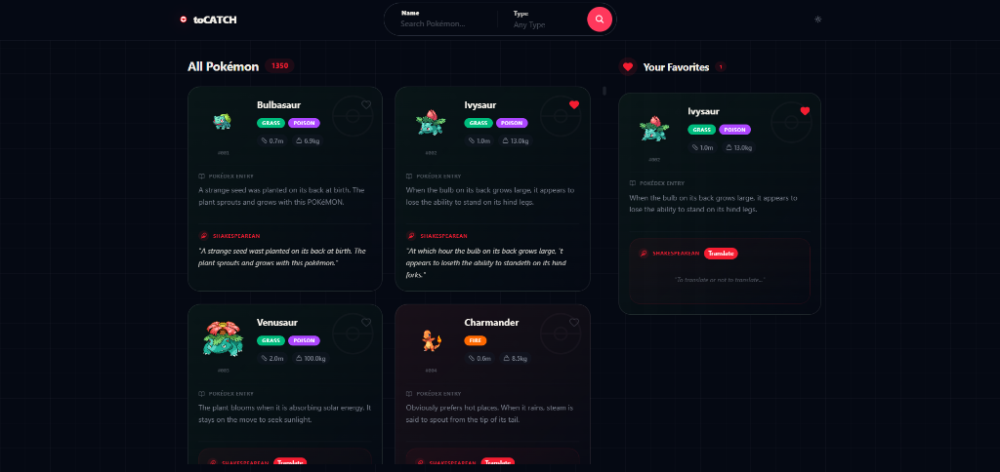

# toCATCH - Pokémon Pokédex



> **⚠️ Test Project** - This is a project created as a technical exercise to demonstrate the use of React 19, TanStack Start, SSR, virtualization, and modern architecture.

---

## 🛠️ Tech Stack

### Core Framework
| Technology | Version | Purpose |
|------------|---------|---------|
| **React** | 19.2 | UI library with latest features (no memo/useCallback needed) |
| **TypeScript** | 5.7 | Type safety and developer experience |
| **Vite** | 7.x | Build tool and dev server |

### Routing & Data Fetching
| Technology | Purpose |
|------------|---------|
| **TanStack Router** | File-based routing with SSR support |
| **TanStack Start** | Full-stack React framework with SSR via Nitro |
| **TanStack Query** | Async state management with SSR hydration |
| **Nitro** | Universal server runtime for SSR/SSG |

### Styling
| Technology | Purpose |
|------------|---------|
| **Tailwind CSS v4** | Utility-first styling |
| **shadcn/ui** | Headless component primitives |
| **Base UI** | Accessible base components |

### State Management
| Technology | Purpose |
|------------|---------|
| **Zustand + persist** | Client state with localStorage persistence |
| **TanStack Query** | Server state with dehydration/hydration |

---

## 📁 Project Architecture

```
src/
├── components/ui/      # Reusable UI primitives (shadcn)
├── features/           # Feature-based modules
│   ├── common/         # Shared components & hooks
│   ├── favorites/      # Favorites feature
│   ├── navigation/     # NavBar, SearchBar, BottomNav
│   └── pokemon/        # Pokemon cards & list
├── lib/                # Utilities (cn, translation-cache)
├── routes/             # TanStack Router file routes
├── services/           # API layer
├── store/              # Zustand global store
└── types.ts            # TypeScript interfaces
```

---

## 🚀 Server-Side Rendering (SSR)

### How TanStack Start SSR Works

TanStack Start uses **Nitro** as universal server runtime. The flow:

```
1. Request hits Nitro server
2. Route loader executes on server
3. queryClient.ensureQueryData() fetches data server-side
4. Query cache is dehydrated into HTML
5. Client hydrates and reuses cached data
```

### Route Loader Implementation

```typescript
// routes/index.tsx
export const Route = createFileRoute('/')({
  component: App,
  loader: async () => {
    // 1. Prefetch complete Pokemon list (1000+ items)
    const basicList = await queryClient.ensureQueryData({
      queryKey: ['allPokemonBasic'],
      queryFn: fetchAllPokemonBasicInfo,
      staleTime: 1000 * 60 * 60 * 24, // 24 hours
    })

    // 2. Prefetch first 12 Pokemon details for instant display
    const first12 = basicList.results.slice(0, 12)
    await Promise.all(
      first12.map((pokemon) =>
        queryClient.ensureQueryData({
          queryKey: ['pokemonDetail', pokemon.name],
          queryFn: () => getPokemonWithDescription(pokemon.name, pokemon.url),
          staleTime: 1000 * 60 * 60 * 24,
        }),
      ),
    )

    return basicList
  },
})
```

### Benefits
- **Zero loading spinners** for initial 12 cards
- **Full list available immediately** for client-side filtering
- **SEO friendly** - content in initial HTML

---

## 🔄 TanStack Query Strategy

### Query Configuration

```typescript
// routes/__root.tsx
export const queryClient = new QueryClient({
  defaultOptions: {
    queries: {
      staleTime: 1000 * 60 * 5,      // 5 min before refetch
      gcTime: 1000 * 60 * 30,        // 30 min in garbage collection
      retry: 2,                       // Retry failed requests twice
      refetchOnWindowFocus: false,    // Don't refetch on tab focus
    },
  },
})
```

### Query Keys Structure

| Query Key | Data | Cache |
|-----------|------|-------|
| `['allPokemonBasic']` | List of all Pokemon names/urls | SSR + 24h |
| `['pokemonDetail', name]` | Single Pokemon full data | SSR + 24h |
| `['pokemonByType', type]` | Pokemon filtered by type | On demand |

### Data Fetching Hooks

```typescript
// Fetches visible Pokemon details only (virtualization aware)
const detailsMap = usePokemonDetails(visibleItems)

// useQueries under the hood fetches in parallel
// Only items currently in viewport are queried
```

---

## 💾 State Persistence

### Zustand with localStorage

```typescript
export const useAppStore = create<AppState>()(
  persist(
    (set, get) => ({
      favorites: [],
      theme: 'system',
      // ... actions
    }),
    {
      name: 'tcontc-app-storage',  // localStorage key
      partialize: (state) => ({
        favorites: state.favorites,  // Persisted
        theme: state.theme,          // Persisted
      }),
      onRehydrateStorage: () => (state) => {
        if (state) applyTheme(state.theme)  // Apply on load
      },
    },
  ),
)
```

### What's Persisted (localStorage)
- ✅ Favorites list
- ✅ Theme preference

### What's NOT Persisted (RAM only)
- ❌ Search query
- ❌ Selected type filters
- ❌ Active tab

---

## ⚡ List Virtualization

Using `@tanstack/react-virtual`:

```typescript
const rowVirtualizer = useVirtualizer({
  count: rowCount,
  getScrollElement: () => parentRef.current,
  estimateSize: () => 450,
  measureElement: (el) => el.getBoundingClientRect().height + 24,
  overscan: 3,
})
```

- **Dynamic row measurement** for variable card heights
- **Responsive columns** (1 mobile, 2 desktop)
- **Only visible rows rendered** (3 row overscan)

---

## ♿ Accessibility

- `<main>` landmark for content
- `aria-label` on icon buttons
- Meta description for SEO
- Keyboard navigation support

---

## 🔌 External APIs

| API | Endpoint | Rate Limit |
|-----|----------|------------|
| PokéAPI | `pokeapi.co/api/v2` | Unlimited |
| Shakespeare | `api.funtranslations.com` | 5/hour |

---

## 📦 Scripts

```bash
pnpm dev       # Dev server :3000
pnpm build     # Production build
pnpm preview   # Preview build
pnpm check     # Biome lint + format
```

---

## 🚀 Deploy

Configured for **Vercel** with Nitro preset:

```bash
npx vercel
```
